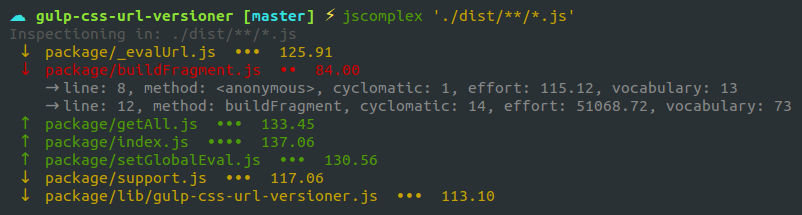
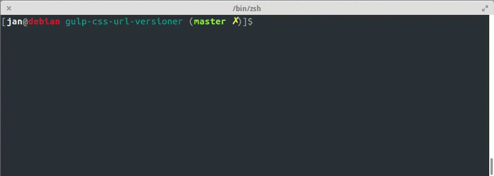

# jscomplex [![NPM version][npm-image]][npm-url]
A colorful reporter for maintainability index via escomplex




## Install Globally

```
sudo npm install jscomplex -g
```

## Install like a development dependency

```
npm install --save-dev jscomplex
```

## How to use



## Use it from `npm scripts`

`package.json`

```json
"scripts": {
    "complex": "jscomplex ./js/**/*.js"
}
```

Then in a terminal:

```bash
npm run complex
```

## Or Use from terminal

```
jscomplex "['./lib/*.js', './bin/*.js']"
```

## Pre-requisites

node version >= 4.0.0


## Help

```
jscomplex -h
```
*Output*

```bash
  Usage: jscomplex [options] <path>

  Options:

    -h, --help                        output usage information
    -V, --version                     output the version number
    -j, --json                        specify json as the output format of the report
    -M, --mi <maintainability index>  specify the per-module maintainability index threshold
    -l, --logicalor                   disregard operator || as source of cyclomatic complexity
    -w, --switchcase                  disregard switch statements as source of cyclomatic complexity
    -i, --forin                       treat for...in statements as source of cyclomatic complexity
    -t, --trycatch                    treat catch clauses as source of cyclomatic complexity
    -n, --newmi                       use the Microsoft-variant maintainability index (scale of 0 to 100)
    -Q, --nocoresize                  don't calculate core size or visibility matrix

  Examples:

    # Analize all *.js files from "lib" folder
    $ jscomplex "['./lib/*.js']"

    # Analize all *.js files from "lib" and "bin" folder
    $ jscomplex "['./lib/*.js', './bin/*.js']"

    # Analize all *.js files
    $ jscomplex "['./**/*.js']"
```


## Enjoy it!


[npm-image]: http://img.shields.io/npm/v/jscomplex.svg
[npm-url]: https://www.npmjs.org/package/jscomplex
